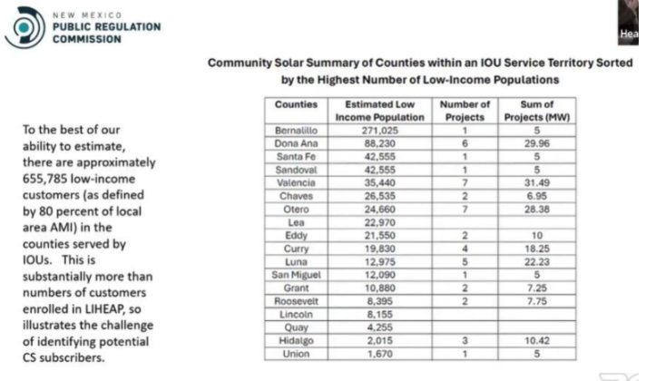

```{r setup, include=FALSE}

source('helper_functions.R')
load_packages()


```


# Overview

The New Mexico project does not offer geoqualificaiton, however does a number of methods to verify LMI qualification.  

```{r message=FALSE, warning=FALSE, include=FALSE}

#state_list <- c("IL", "MA", "MN", "NJ", "NM", "NY",  "CA")

state_list <- c("NM")

hifld_df <- st_read("utility_zones/HIFLD/Electric_Retail_Service_Territories (1)/Electric_Retail_Service_Territories.shp") 

temp_util <- hifld_df %>%
  filter(ID %in% c(15473, 10817, 5701)) %>%
  mutate(new_name = case_when(
    ID == 15473 ~ "Public Service Company",
    ID == 10817 ~ "Xcel",
    ID == 5701 ~ "El Paso Electric"
  ))


census_api_key('ba3d95cae3658f3145daf7f66119ed58a52aaca3')

get_tracts <- get_acs(
  geography="tract", 
  state=state_list,
  variables=c("Median Income" = "S1901_C01_012E"),
  year=2017, 
  geometry=TRUE) %>%
  mutate(MedInc = estimate) %>%
  select(geoid=GEOID, geometry)

get_zips <- get_acs(
  geography="zcta", 
  state="NM",
  variables=c("Median Income" = "S1901_C01_012E"),
  year=2017, 
  geometry=TRUE) %>%
  mutate(MedInc = estimate) %>%
  select(geoid=GEOID, geometry)


el_paso_zips <- c(88021,88012,88011,88007,88006,88005,88003,87937,88013,88004,88002,88001)
             
xnm_zips <- c(88201,88130,88253,88244,88221,88252,88240,88241,88230,88101,88102,88220,88211,88135,88202,88203,88123,88256,88401,88242,88232,88231,88103,88210)

pnm_zips <- c(87507,87031,87002,87504,87508,87592,87594,88345,88045,87144,87123,87048,87114,87121,87122,87111,87124,88062,88036,87107,87113,87503,87174,87006,87502,87505,87506,87509,87540,87745,88311,88022,88030,88031,88023,88055,88009,88310,87031,87501,87701,88355,88061,88053,88415)


get_zips <- get_zips %>%
  mutate(geoid_int = as.integer(geoid)) %>%
  mutate(
    el_paso_tag = case_when(
     geoid_int %in% el_paso_zips ~ TRUE,
      TRUE ~ FALSE
    ),
      xnm_tag = case_when(
     geoid_int %in% xnm_zips ~ TRUE,
      TRUE ~ FALSE
    ),
      pnm_tag = case_when(
     geoid_int %in% pnm_zips ~ TRUE,
      TRUE ~ FALSE
    )
    )


```


```{r message=FALSE, warning=FALSE, include=FALSE}
get_zips <- st_transform(get_zips, st_crs(temp_util))

zip_table <- get_zips %>%
  st_point_on_surface() %>%
  st_join(temp_util %>% select(Utility = new_name)) %>%
  st_drop_geometry()

zip_table
```


# Geoqualification

In New Mexico, there is no geographic qualification methods, so we only focus on estimating the potential LMI population by various methods used in the state program. 


```{r message=FALSE, warning=FALSE, include=FALSE}
chas_df <- load_chas() %>%
    mutate(State_Name = case_when(
    state == 17 ~ "Illinois",
    state == 25 ~ "Massachusetts",  
    state == 27 ~ "Minnesota",  
    state == 34 ~ "New Jersey",
    state == 35 ~ "New Mexico",  
    state == 36 ~ "New York",
    state == 06 ~ "California",
    TRUE ~ "Other"
  ))


add_geo <- merge(chas_df, get_tracts) 

add_geo <- st_as_sf(add_geo)

nm_geo <- add_geo %>%
  filter(State_Name %in% c("New Mexico"))

temp_util <- st_transform(temp_util, st_crs(nm_geo)) %>%
  st_make_valid()
```


## Utility Zones and ZIP Codes


```{r message=FALSE, warning=FALSE, include=FALSE}

utility_to_zip <- function(get_zips, utility_zone) {
  
 # string_name = utility_zone
  temp_zone <- utility_zone 
  
    # Transform only if CRS does not match
  if (!st_crs(get_zips) == st_crs(temp_zone)) {
    temp_zone <- st_transform(temp_zone, st_crs(get_zips)) %>%
      st_make_valid()
  }

  # Assuming st_area has been calculated for temp_util in the global environment
  temp_zone$area <- st_area(temp_zone)

  # Compute intersection summary only if it's not already done
  if (!"area" %in% names(get_zips)) {
    get_zips$area <- st_area(get_zips)
  }
  
  intersection_summary <- st_intersection(get_zips, temp_zone) %>%
    mutate(intersection_area = st_area(geometry)) %>%
    st_drop_geometry() %>%
    group_by(geoid) %>%
    summarize(intersection_area = sum(intersection_area))
  
  get_zips_coverage <- get_zips %>%
    left_join(intersection_summary, by = "geoid") %>%
    mutate(coverage = ifelse(is.na(intersection_area), 0, intersection_area / area))
  
  utility_zips <- get_zips_coverage %>%
    filter(coverage >= 0.05) # captures zips with 5% of area covered by Utility Zone

# 
#   utility_zips$Utility <- "ny_zone_e"
#   utility_name <- "ny_zone_e"
  # Save to CSV
  # filename <- paste0(utility_name, "_Zips.csv")
  # utility_zips %>%
  #  # st_drop_geometry() %>%
  #   write.csv(filename)
  # 
  return(utility_zips)
}

el_paso_zone <- temp_util %>%
  filter(ID == 5701)

pnm_zone <- temp_util %>%
  filter(ID == 15473)

xnm_zone <- temp_util %>%
  filter(ID == 10817)


el_paso_zips_df <- utility_to_zip(get_zips,el_paso_zone )

el_paso_zips_df$Utility_Tagged <- "El Paso Eletric"

pnm_zips_df <- utility_to_zip(get_zips,pnm_zone )
pnm_zips_df$Utility_Tagged <- "Public Service Company"

xnm_zips_df <- utility_to_zip(get_zips,xnm_zone )
xnm_zips_df$Utility_Tagged <- "Xcel"


all_zips <- rbind(el_paso_zips_df, pnm_zips_df,xnm_zips_df) 


get_zips <- get_zips %>%
  mutate(
    el_paso_coverage_tag = case_when(
     geoid_int %in% el_paso_zips_df$geoid_int ~ TRUE,
      TRUE ~ FALSE
    ),
      pnm_tag_coverage_tag = case_when(
     geoid_int %in% pnm_zips_df$geoid_int ~ TRUE,
      TRUE ~ FALSE
    ),
      xnm_tag_coverage_tag = case_when(
     geoid_int %in% xnm_zips_df$geoid_int ~ TRUE,
      TRUE ~ FALSE
    )
    )


```


Solstice operates in the following three utility zones in New Mexico:

  * Public Service Company of New Mexico
  * Excel
  * El Paso Electric

```{r echo=FALSE, message=FALSE, warning=FALSE}

pal5 <- colorFactor(
  palette="viridis",
  domain=temp_util$new_name
)

pal_2 <- colorFactor(
  palette = c( NA, "Red"),
  domain = get_zips$el_paso_tag
)

leaflet() %>%
  addProviderTiles("CartoDB.Positron") %>%
  addPolygons(data=temp_util,
              group="Utility Zones",
              stroke=TRUE,
              color=~pal5(temp_util$new_name),
              dashArray="3",
              fillOpacity=0.5,
              popup=paste("Utility Zone: ", temp_util$new_name)) %>%
  addPolygons(data=get_zips,
              group="ZIPs",
              weight = 1,
              fillOpacity = 0,
              color="black",
             # color = ~pal_2(get_zips$el_paso_tag),
              dashArray = "3,3",
              popup=paste("ZIP Code: ", get_zips$geoid)) %>%
  addLegend(position="bottomright",
            pal=pal5,
            values=temp_util$new_name,
            title="Solstice NM Utilities") %>%
  
  addPolygons(data=el_paso_zips_df,
              group="El Paso Zips",
              weight =1 ,
              fillOpacity = 0.6,
              color="purple",
              popup=paste("Zip Code: ", el_paso_zips_df$geoid_int)) %>%
  addPolygons(data=pnm_zips_df,
              group="PNM Zips",
              weight =1 ,
              fillOpacity = 0.6,
              color="orange",
              popup=paste("Zip Code: ", pnm_zips_df$geoid_int)) %>%
  addPolygons(data=xnm_zips_df,
              group="Xcel Zips",
              weight =1 ,
              fillOpacity = 0.6,
              color="green",
              popup=paste("Zip Code: ", xnm_zips_df$geoid_int) )%>%
              
  
    addLayersControl(
        overlayGroups=c( "Utility Zones", "ZIPs", "El Paso Zips", "PNM Zips", "Xcel Zips"))


```
  
  
The table below shows all the zip codes in New Mexico that are covered by at least 5% of any of the three utilities. Note, a few zip codes may have multiple utilities covering it. 

```{r echo=FALSE, message=FALSE, warning=FALSE}

temp_zips <- all_zips %>%
  st_drop_geometry() %>%
  mutate(coverage = percent(coverage)) %>%
  select(Zip = geoid,  Utility_Tagged, coverage)

datatable(
  temp_zips,
  extensions = 'Buttons', 
  options = list(
    dom = 'Bfrtip',
    buttons = 
      list(
        list(
          extend = 'csv',
          filename = "All_Zips",
          title = ''
        )
      )
  )
)
```

# LMI Qualification


New Mexico LMI Qualification methods include:


  * Medicaid
  * SNAP
  * LIHEAP
  * First-time home owner programs
  * Affordable housing facilities
    - HUD data ([potential example](https://resources.hud.gov/#layers-menu))
    - State specific ([potential example](https://housingnm.org/find-housing/rentals/affordable))
  * State and federal income tax credit
  * Entire multi-family housing project may qualify if the entire load can be proved to be low-income subscribers, with consent of all tenants of record.
  * **LMI - 80% of AMI**
  

Census data is available for the population receiving Medicaid, SNAP, and number of households at or below 80% AMI. The following analysis quantifies the total eligible LMI population by each of these three categories.

```{r message=FALSE, warning=FALSE, include=FALSE}

  # * Medicaid
  #   - total count of population with Medicaid- C27007_004 + C27007_007 + C27007_010 + C27007_014 + C27007_017 + C27007_020
  #   - geo: tract
  #   
  # * SNAP
  #   - total count of HH received Food Stamps/SNAP in last 12 months - B22001_002
  #   - total count of population received Food Stamps/SNAP in last 12 months - B19058_002
  #   - geo: tract
  # * LIHEAP
  #   - use this to calculate income by self attestation? 
  #   https://www.acf.hhs.gov/sites/default/files/documents/ocs/comm_liheap_im2002smiattachment_fy2021.pdf
  #   
  # * first-time home owner programs
  # * affordable housing facilities
  #   - HUD data: https://resources.hud.gov/#layers-menu
  #   - state specific to supplement: https://housingnm.org/find-housing/rentals/affordable
  # * low-income housing
  # * state and federal income tax credit
  # * entire multi-family housing project may qualify if the entire load can be proved to be low-income subscribers, with consent of all tenants of record.
  # 
  # LMI - 80% of AMI from HUD..
# acs_vars <- load_variables(2019, "acs5")

nm_tracts <- get_acs(
  geography="tract", 
  state=state_list,
  variables=c("snap_hh" = "B22001_002",
              "snap_pop" = "B19058_002",
              "medicaid_1" = "C27007_004",
              "medicaid_2" = "C27007_007",
              "medicaid_3" = "C27007_010",
              "medicaid_4" = "C27007_014",
              "medicaid_5" = "C27007_017",
              "medicaid_6" = "C27007_020",
              "tract_pop" = "B01001_001",
              "median_fam_income" = "B19126_001",
              "income_below_pov" = "B17001H_002",
              'hh_owner' = 'B25106_002',
              'hh_renter' = 'B25106_024'
              
              
              ),
  year=2019, 
  geometry=TRUE) %>%
  group_by(GEOID) %>%
  summarize(snap_hh = estimate[variable=="snap_hh"],
            medicaid_pop =estimate[variable=="medicaid_1"] + 
                          estimate[variable=="medicaid_2"] +
                          estimate[variable=="medicaid_3"] +
                          estimate[variable=="medicaid_4"] +
                          estimate[variable=="medicaid_5"] +
                          estimate[variable=="medicaid_6"] ,
            tract_pop = estimate[variable=="tract_pop"],
            median_fam_income = estimate[variable=="median_fam_income"],
            income_below_pov = estimate[variable=="income_below_pov"],
            
            percent_renter = 
                estimate[variable=="hh_renter"]/(estimate[variable=="hh_renter"] + estimate[variable=="hh_owner"])
            )

total_nm_tracts <- cbind(nm_geo, nm_tracts)

# nm_tracts %>%
#   st_drop_geometry() %>%
#   write_csv("/Users/jacobford/Library/CloudStorage/GoogleDrive-jake@solstice.us/My Drive/LMI ID Hackathon November 2023/Census Data/final_data/census_tract_data_no_geo.csv")
# 
# nm_tracts %>%
#   st_write("/Users/jacobford/Library/CloudStorage/GoogleDrive-jake@solstice.us/My Drive/LMI ID Hackathon November 2023/Census Data/final_data/census_tract_data.geojson")
#   
#   

# nm_block_groups <- get_acs(
#   geography = "block group",
#   state = state_list, 
#   variables = c(
#                 # Education Variables
#                 'B15003_002','B15003_003','B15003_004','B15003_005','B15003_006','B15003_007',
#                 'B15003_008','B15003_009','B15003_010','B15003_011','B15003_012','B15003_013',
#                 'B15003_014','B15003_015','B15003_016','B15003_017','B15003_018','B15003_019',
#                 'B15003_020','B15003_021','B15003_022','B15003_023','B15003_024','B15003_025',
#                 
#                 # unemployed
#                 'B23025_005',
#                 
#                 # block group pop
#                 
#                 'B01001_001'
#                 
#                 ),
#   geometry =TRUE
# ) %>%
#   group_by(GEOID) %>%
#   summarize(education_below_hs =
#                           estimate[variable=="B15003_002"] + 
#                           estimate[variable=="B15003_003"] +
#                           estimate[variable=="B15003_004"] +
#                           estimate[variable=="B15003_005"] +
#                           estimate[variable=="B15003_006"] +
#                           estimate[variable=="B15003_007"] +
#                           estimate[variable=="B15003_008"] +
#                           estimate[variable=="B15003_009"] +
#                           estimate[variable=="B15003_010"] +
#                           estimate[variable=="B15003_011"] +
#                           estimate[variable=="B15003_012"] + 
#                           estimate[variable=="B15003_013"] +
#                           estimate[variable=="B15003_014"] +
#                           estimate[variable=="B15003_015"] +
#                           estimate[variable=="B15003_016"], 
#             
#             education_hs_some_college = 
#                           estimate[variable=="B15003_017"] + 
#                           estimate[variable=="B15003_018"] +
#                           estimate[variable=="B15003_019"] +
#                           estimate[variable=="B15003_020"],
#             
#             education_college =
#                       estimate[variable=="B15003_021"] + 
#                       estimate[variable=="B15003_022"],
#             
#             education_advanced =
#                       estimate[variable=="B15003_023"] + 
#                       estimate[variable=="B15003_024"] +
#                       estimate[variable=="B15003_025"],
#             
#             unemployed_pop = estimate[variable=="B23025_005"],
#             
#             block_group_pop = estimate[variable=="B01001_001"]
#             
#             )


# nm_block_groups %>%
#   st_drop_geometry() %>%
#   write_csv("/Users/jacobford/Library/CloudStorage/GoogleDrive-jake@solstice.us/My Drive/LMI ID Hackathon November 2023/Census Data/final_data/census_block_group_data_no_geo.csv")
# 
# nm_block_groups %>%
#   st_write("/Users/jacobford/Library/CloudStorage/GoogleDrive-jake@solstice.us/My Drive/LMI ID Hackathon November 2023/Census Data/final_data/census_block_group_data.geojson", append=FALSE)
# 
# nm_block_groups <- st_read("/Users/jacobford/Library/CloudStorage/GoogleDrive-jake@solstice.us/My Drive/LMI ID Hackathon November 2023/Census Data/final_data/census_block_group_data.geojson")
# ### Block Groups

# 
# blocks_2020_pop <- get_decennial(
#  geography="block",
#  variables= "P1_001N", 
#  state = state_list,
#  year=2020,
#  geometry=TRUE
# )%>%
#   mutate(block_pop=value) 
# 
# 
# blocks_2020_gq_pop_prison <- get_decennial(
#  geography="block",
#  variables= "P5_003N", 
#  state = state_list,
#  year=2020,
#  geometry=TRUE
# )%>%
#   mutate(gq_pop_prison=value) 
# 
# 
# blocks_2020_gq_pop_juvenille <- get_decennial(
#  geography="block",
#  variables= "P5_004N", 
#  state = state_list,
#  year=2020,
#  geometry=TRUE
# )%>%
#   mutate(gq_pop_juvenille=value) 
# 
# 
# blocks_2020_vacant_hhs <- get_decennial(
#  geography="block",
#  variables= "H1_003N", 
#  state = state_list,
#  year=2020,
#  geometry=TRUE
# )%>%
#   mutate(vacant_hhs=value) 

# Race

# 
# blocks_2020_white <- get_decennial(
#  geography="block",
#  variables= "P1_003N", 
#  state = state_list,
#  year=2020,
#  geometry=TRUE
# )%>%
#   mutate(race_white=value) 
# 
# 
# blocks_2020_black <- get_decennial(
#  geography="block",
#  variables= "P1_004N", 
#  state = state_list,
#  year=2020,
#  geometry=TRUE
# )%>%
#   mutate(race_black=value) 
# 
# 
# blocks_2020_american <- get_decennial(
#  geography="block",
#  variables= "P1_005N", 
#  state = state_list,
#  year=2020,
#  geometry=TRUE
# )%>%
#   mutate(race_american_indian=value) 
# 
# 
# blocks_2020_asian <- get_decennial(
#  geography="block",
#  variables= "P1_006N", 
#  state = state_list,
#  year=2020,
#  geometry=TRUE
# )%>%
#   mutate(race_asian=value) 
# 
# 
# blocks_2020_native_pacific <- get_decennial(
#  geography="block",
#  variables= "P1_007N", 
#  state = state_list,
#  year=2020,
#  geometry=TRUE
# )%>%
# #   mutate(race_native_pacific=value) 
# 
# blocks_2020_other <- get_decennial(
#  geography="block",
#  variables= "P1_008N", 
#  state = state_list,
#  year=2020,
#  geometry=TRUE
# )%>%
#   mutate(race_other=value) 
# 
# blocks_2020_two <- get_decennial(
#  geography="block",
#  variables= "P1_009N", 
#  state = state_list,
#  year=2020,
#  geometry=TRUE
# )%>%
#   mutate(race_two=value) 
# 
# 
# 
# 
# nm_blocks <- cbind(blocks_2020_pop,blocks_2020_gq_pop_prison, blocks_2020_gq_pop_juvenille,
#                    blocks_2020_vacant_hhs, blocks_2020_white, blocks_2020_black, blocks_2020_american,
#                    blocks_2020_native_pacific, blocks_2020_asian, blocks_2020_other, blocks_2020_two) %>%
#   select(GEOID, NAME,block_pop,gq_pop_prison, gq_pop_juvenille, vacant_hhs,
#          race_white, race_black, race_american_indian, race_asian, race_native_pacific,
#          race_other, race_two) 
# 
# rm(blocks_2020_american)
# rm(blocks_2020_asian)
# rm(blocks_2020_black)
# rm(blocks_2020_gq_pop_juvenille)
# rm(blocks_2020_gq_pop_prison)
# rm(blocks_2020_native_pacific)
# rm(blocks_2020_other)
# rm(blocks_2020_two)
# rm(blocks_2020_white)
# rm(blocks_2020_vacant_hhs)


# nm_blocks %>%
#   st_drop_geometry() %>%
#   write_csv("/Users/jacobford/Library/CloudStorage/GoogleDrive-jake@solstice.us/My Drive/LMI ID Hackathon November 2023/Census Data/final_data/census_block_data_no_geo.csv")
# 
# nm_blocks %>%
#   st_write("/Users/jacobford/Library/CloudStorage/GoogleDrive-jake@solstice.us/My Drive/LMI ID Hackathon November 2023/Census Data/final_data/census_block_data.geojson")
# 

```


The table below shows total population by LMI qualification method by utility area coverage. Note, these LMI groups are not mutually exclusive, rather are snap shots of the individual method's population. 

```{r echo=FALSE, message=FALSE, warning=FALSE}


temp <- total_nm_tracts %>% 
  st_point_on_surface() %>%
  st_make_valid() %>%
  st_join(temp_util %>% select(NAME)) %>%
  st_drop_geometry() %>%
  group_by(Name = NAME) %>%
  filter(!is.na(Name)) %>%
  summarize(`80% AMI` = sum(AMI_80),
            `100% AMI` = sum(AMI_100),
            `Medicaid` = sum(medicaid_pop),
            `SNAP HH` = sum(snap_hh),
            `Total Population` = sum(tract_pop)) %>%
  arrange(desc(`80% AMI`)) %>%
  adorn_totals("row")

datatable(temp, caption = "New Mexico, Sources: ACS 2019 and HUD CHAS")%>%
  formatCurrency('80% AMI',currency = "", interval = 3, digits = 0, mark = ",") %>%
  formatCurrency('100% AMI',currency = "", interval = 3, digits = 0, mark = ",") %>%
  formatCurrency('Medicaid',currency = "", interval = 3, mark = ",", digits = 0) %>%
  formatCurrency('SNAP HH',currency = "", interval = 3, mark = ",", digits = 0) %>%
  formatCurrency('Total Population',currency = "", interval = 3, mark = ",", digits = 0) 


```


```{r message=FALSE, warning=FALSE, include=FALSE}

temp %>%
  filter(Name=="Total") %>%
  write_csv("docs/final_data/nm_lmi_total.csv")


```


The map shows the census tracts loaded with the LMI qualification methods by utility zone coverage. 


```{r echo=FALSE, message=FALSE, warning=FALSE, fig.height=10, fig.width=8}

nm_df <- add_geo %>%
  filter(State_Name == "New Mexico") 

pal <- colorNumeric(
  palette = "Reds",
 # reverse=TRUE,
  domain = nm_df$AMI_80)

pal2 <- colorNumeric(
  palette = "Purples",
 # reverse=TRUE,
  domain = nm_df$AMI_80_Pct)

pal3 <- colorNumeric(
  palette = "Greens",
 # reverse=TRUE,
  domain = nm_tracts$snap_hh)

pal4 <- colorNumeric(
  palette = "Blues",
 # reverse=TRUE,
  domain = nm_tracts$medicaid_pop)


 


map <- leaflet() %>%
  addProviderTiles("CartoDB.Positron") %>%
  addPolygons(data=temp_util,
              group="Utility Zones",
              stroke=TRUE,
              color="black",
              dashArray="3",
              fillOpacity=0,
              popup=paste("Utility Zone: ", temp_util$new_name)
  ) %>%
  
  addPolygons(
    data = nm_df,
    group="80% AMI",  # This should be consistent with the group name in the addLegend function
    stroke=FALSE,
    smoothFactor=0.2,
    fillOpacity=0.7,
    color=~pal(AMI_80),
    popup=paste("Tract: ", nm_df$geoid, "<br>", 
                "HHs at 80% AMI: ", nm_df$AMI_80)
  ) %>%

  addLegend("bottomleft",
            group="80% AMI",  # This should be consistent with the group name in the addPolygons function
            pal = pal,
            values = nm_df$AMI_80,
            title="Number of HHs at 80% AMI"
  ) %>%
  
  # addPolygons(
  #   data=nm_df,
  #   group="80% AMI Percent",  # This should be consistent with the group name in the addLegend function
  #   stroke=FALSE,
  #   smoothFactor=0.2,
  #   fillOpacity=0.7,
  #   color=~pal2(AMI_80_Pct),
  #   popup=paste("Tract: ", nm_df$geoid, "<br>", 
  #               "Percent of HHs at 80% AMI: ", nm_df$AMI_80_Pct)
  # ) %>%
  # 
  # addLegend("bottomleft",
  #           group="80% AMI Percent",  # This should be consistent with the group name in the addPolygons function
  #           pal = pal2,
  #           values = nm_df$AMI_80_Pct,
  #           title="Percent of HHs at 80% AMI"
  # ) %>%
  
  addPolygons(
    data=nm_tracts,
    group="SNAP",
    stroke=FALSE,
    smoothFactor=0.2,
    fillOpacity=0.7,
    color=~pal3(snap_hh),
    popup=paste("Tract: ", nm_tracts$GEOID, "<br>", 
                "Number of HHs Receiving SNAP: ", nm_tracts$snap_hh)
  ) %>%
  
  addLegend("bottomleft",
            group="SNAP",
            pal = pal3,
            values = nm_tracts$snap_hh,
            title="Number of HHs Receiving SNAP:"
  ) %>%
  
    addPolygons(
    data=nm_tracts,
    group="Pop",
    stroke=FALSE,
    smoothFactor=0.2,
    fillOpacity=0.7,
    color=~pal3(tract_pop),
    popup=paste("Tract: ", nm_tracts$GEOID, "<br>", 
                "Tract Population: ", nm_tracts$tract_pop)
  ) %>%
  
  addLegend("bottomleft",
            group="Pop",
            pal = pal3,
            values = nm_tracts$tract_pop,
            title="Tract Pop:"
  ) %>%
  
  addPolygons(
    data=nm_tracts,
    group="Medicaid",
    stroke=FALSE,
    smoothFactor=0.2,
    fillOpacity=0.7,
    color=~pal4(medicaid_pop),
    popup=paste("Tract: ", nm_tracts$GEOID, "<br>", 
                "Number of HHs Receiving Medicaid: ", nm_tracts$medicaid_pop)
  ) %>%
  
  addLegend("bottomleft",
            group="Medicaid",
            pal = pal4,
            values = nm_tracts$medicaid_pop,
            title="Number of HHs Receiving Medicaid:"
  ) %>%
   
  addLayersControl(
    overlayGroups=c( "80% AMI", "Utility Zones", "SNAP", "Medicaid"),  # Update the order for consistency
    options = layersControlOptions(collapsed = FALSE)
  )

map %>%
 hideGroup("SNAP") %>% hideGroup("80% AMI") %>% hideGroup("Medicaid")

```


## LMI Population by County

The below table and graph shows the total LMI population by county in New Mexico. This is definied by the population living at 80% AMI. This data is estimated using three different methods:

- HUD LMI Population by Block Group Data
- HUD CHAS Data with Average HH Size Estimate
- New Mexico Commission Estimate

The third method is taken directly from the New Mexico commission meeting data: 




```{r message=FALSE, warning=FALSE, include=FALSE}
hud_shp <- st_read("data/HUD/LOW_MOD_INCOME_BY_BG_-3053113168306498036/Low_to_Moderate_Income_Population_by_Block_Group.shp") %>%
  filter(Stusab == "NM") 

hud_lmi_df <- read_csv("data/HUD/LOW_MOD_INCOME_BY_BG_-8762454996677272279.csv") %>%
  filter(Stusab == "NM") %>%
  group_by(County = Countyname) %>%
  summarize(`Low Income` = sum(Low),
            `LMI` = sum(Lowmod),
            `Total` = sum(Lowmoduniv))

hud_lmi_df

```


```{r message=FALSE, warning=FALSE, include=FALSE}
# string_name = utility_zone
temp_zone <- temp_util 

  # Transform only if CRS does not match
if (!st_crs(hud_shp) == st_crs(temp_zone)) {
  temp_zone <- st_transform(temp_zone, st_crs(hud_shp)) %>%
    st_make_valid()
}

# Assuming st_area has been calculated for temp_util in the global environment
temp_zone$area <- st_area(temp_zone)

# Compute intersection summary only if it's not already done
if (!"area" %in% names(hud_shp)) {
  hud_shp$area <- st_area(hud_shp)
}

intersection_summary <- st_intersection(hud_shp, temp_zone) %>%
  mutate(intersection_area = st_area(geometry)) %>%
  st_drop_geometry() %>%
  group_by(GEOID) %>%
  summarize(intersection_area = sum(intersection_area))

get_county_coverage <- hud_shp %>%
  left_join(intersection_summary, by = "GEOID") %>%
  mutate(coverage = ifelse(is.na(intersection_area), 0, intersection_area / area))

final_table <- get_county_coverage %>%
  st_drop_geometry() %>%
  mutate(Lowmod = as.integer(Lowmod)) %>%
  group_by(Countyname) %>%
  mutate(CoveredPop = coverage * Lowmod ) %>%
  summarize(CoveredPop = sum(CoveredPop, na.rm=T))

# change CoveredPop to not be in scientific notation, round it and sort by CoveredPop highest to lowest
final_table$CoveredPop <- format(final_table$CoveredPop, scientific = FALSE)

#

final_table_method_1 <- final_table %>%
  mutate(CoveredPop = as.numeric(CoveredPop)) %>%
  filter(CoveredPop > 0) %>%
  arrange(desc(CoveredPop)) %>%
  mutate(CoveredPop = round(CoveredPop, 0)) %>%
  select(County = Countyname, LMI=CoveredPop)

final_table_method_1

# utility_counties <- get_county_coverage %>%
#   filter(coverage >= 0.05) # captures zips with 5% of area covered by Utility Zone
```


```{r message=FALSE, warning=FALSE, include=FALSE}

### Method 2: HUD CHAS Data with Average HH Size Estimate

# get census tract level data for NM using get_acs, for variables B25010
nm_avg_hh_size <- get_acs(
  geography = "tract",
  state = "NM",
  variables = c("B25010_001"),
  year = 2019, 
  geometry = FALSE)

temp_nm <- merge(nm_avg_hh_size, add_geo, by.x = "GEOID", by.y = "geoid")

temp_nm <- st_as_sf(temp_nm)

temp_nm$total_lmi_pop <- temp_nm$estimate * temp_nm$AMI_80

# add geo back in


temp_nm <- st_as_sf(temp_nm)

# create a new variable called countyName that pulls the county name from the 'NAME' column with values like this: Census Tract 1.07, Bernalillo County, New Mexico

# create a new variable called countyName that takes the value of the string 'NAME' after the first comma but before the second comma
temp_nm$countyName <- str_extract(temp_nm$NAME, "(?<=, ).*(?= County)")

# add " County" to countyName
temp_nm$countyName <- paste(temp_nm$countyName, " County", sep="")

# overlay same way as method 1: 

# string_name = utility_zone
temp_zone <- temp_util 

  # Transform only if CRS does not match
if (!st_crs(temp_nm) == st_crs(temp_zone)) {
  temp_zone <- st_transform(temp_zone, st_crs(temp_nm)) %>%
    st_make_valid()
}

# Assuming st_area has been calculated for temp_util in the global environment
temp_zone$area <- st_area(temp_zone)

# Compute intersection summary only if it's not already done
if (!"area" %in% names(temp_nm)) {
  temp_nm$area <- st_area(temp_nm)
}

intersection_summary <- st_intersection(temp_nm, temp_zone) %>%
  mutate(intersection_area = st_area(geometry)) %>%
  st_drop_geometry() %>%
  group_by(GEOID) %>%
  summarize(intersection_area = sum(intersection_area))

get_county_coverage <- temp_nm %>%
  left_join(intersection_summary, by = "GEOID") %>%
  mutate(coverage = ifelse(is.na(intersection_area), 0, intersection_area / area))

final_table <- get_county_coverage %>%
  st_drop_geometry() %>%
  mutate(Lowmod = as.integer(total_lmi_pop)) %>%
  group_by(countyName) %>%
  mutate(CoveredPop = coverage * Lowmod ) %>%
  summarize(CoveredPop = sum(CoveredPop, na.rm=T))

# change CoveredPop to not be in scientific notation, round it and sort by CoveredPop highest to lowest
final_table$CoveredPop <- format(final_table$CoveredPop, scientific = FALSE)

#

final_table_method_2 <- final_table %>%
  mutate(CoveredPop = as.numeric(CoveredPop)) %>%
  filter(CoveredPop > 0) %>%
  arrange(desc(CoveredPop)) %>%
  mutate(CoveredPop = round(CoveredPop, 0))%>%
  select(County = countyName, LMI_method2=CoveredPop)

final_table_method_2
```

```{r echo=FALSE, message=FALSE, warning=FALSE}
combined_tables <- merge(final_table_method_1, final_table_method_2, by="County") 
 
nm_control_data <- data.frame(
  County = c("Bernalillo County", "Dona Ana County", "Santa Fe County", "Sandoval County", "Valencia County", 
             "Chaves County", "Otero County", "Lea County", "Eddy County","Curry County", "Luna County", "San Miguel County", 
             "Grant County", "Roosevelt County", "Lincoln County", "Quay County",   "Hidalgo County", "Union County"),
  'NM_Commission_Est' = c(271025, 88230, 42555, 42555, 35440, 26535, 24660, 
          22970, 21550, 19830, 12975, 12090, 10880, 8395, 8155, 4255, 2015, 1670)
)

combined_tables <- merge(combined_tables, nm_control_data, by="County")

combined_tables <- combined_tables %>%
  filter(LMI * LMI_method2 > 0) %>%
  arrange(desc(LMI))


# make a ggplot of combined_tables, with County on the X axis and three different bar charts for each of the LMI, LMI_method2, and Est_LMI
# make sure to use the fill aesthetic to differentiate between the three different bar charts
# make sure to use the scale_fill_manual function to set the colors of the bars
# make sure to use the labs function to set the title and axis labels
# make sure to use the theme_minimal function to set the theme of the plot


library(ggplot2)
library(dplyr)
library(tidyr)

# Assuming combined_tables has the columns County, LMI, LMI_method2, and Est_LMI

# Reshape the data to long format
long_combined_tables <- combined_tables %>%
  pivot_longer(cols = c(LMI, LMI_method2, NM_Commission_Est), names_to = "Measure", values_to = "Value")

library(scales) # For label_number()

# Assuming combined_tables has been reshaped to long format in long_combined_tables

ggplot(long_combined_tables, aes(x=reorder(County, -Value), y=Value, fill=Measure)) +
  geom_bar(stat="identity", position=position_dodge(width=0.7)) +
  scale_fill_manual(values=c("LMI"="red", "LMI_method2"="blue", "NM_Commission_Est"="green")) +
  labs(title="Low to Moderate Income Population by County", x="County", y="Population") +
  scale_y_continuous(labels=label_number()) + # Format the y-axis labels as numeric
  theme_minimal() +
  theme(axis.text.x = element_text(angle=45, hjust=1))


```


```{r echo=FALSE, message=FALSE, warning=FALSE}

datatable(combined_tables, caption = "New Mexico LMI by County Estimates")%>%
  formatCurrency('LMI',currency = "", interval = 3, mark = ",", digits = 0) %>%
  formatCurrency('LMI_method2',currency = "", interval = 3, mark = ",", digits = 0) %>%
  formatCurrency('NM_Commission_Est',currency = "", interval = 3, mark = ",", digits = 0)  


```


## Low Income Housing

To estimate the total number of New Mexicans residing in low income housing, we first require a list of eligible properties. We take each affordable rental property listed on the [MFA Housing New Mexico](https://housingnm.org/find-housing/rentals/affordable) website. After geocoding each point, we have several options for determining the population concentration around each point. A common technique in transportation modeling is applying an isocrhone, or a travel time map. In our case, we want to see how many eligible population of SNAP, Medicaid and 80% AMI households are within a 15 and 30 minute driving radius around each point. 

```{r eval=FALSE, message=FALSE, warning=FALSE, include=FALSE}
# nm_data <- read_excel("data/nm/nm_public_housing.xlsx")
# 
# 
# 
# library(ggmap)
# 
# # Assuming your 'nm_data' dataframe has columns 'Address' and 'Address 2'
# # Create a new column to store the full address (combining Address and Address 2)
# nm_data$full_address <- paste(nm_data$Address, nm_data$`Address 2`, sep = ", ")
# 
# # Use geocode() to get latitude and longitude for each address
# geocoded_data <- geocode(nm_data$full_address)
# 
# # Add latitude and longitude columns to the original dataframe
# nm_data$Latitude <- geocoded_data$lat
# nm_data$Longitude <- geocoded_data$lon
# 
# nm_data <- nm_data %>%?
#   filter(!is.na(Longitude))
# 
# nm_data <- st_as_sf(nm_data, coords = c("Longitude", "Latitude"), crs = st_crs(nm_tracts))

# st_write(nm_data, "nm_public_housing.shp")


nm_public_housing <- st_read("data/nm/nm_public_housing.shp")

# nm_public_housing_isos <- nm_public_housing %>%
#   mb_isochrone(time = 30, profile = "driving", id_column = "Name",
#                access_token = "blahblahblah"

nm_public_housing_isos_15 <- st_read("isochrones/nm_public_housing_isos_15.shp") 
nm_public_housing_isos_15 <- st_transform(nm_public_housing_isos_15, st_crs(nm_public_housing))

nm_public_housing_isos_30 <- st_read("isochrones/nm_public_housing_isos_30.shp")
nm_public_housing_isos_30 <- st_transform(nm_public_housing_isos_30, st_crs(nm_public_housing))


```

```{r eval=FALSE, message=FALSE, warning=FALSE, include=FALSE}

library(leaflet.extras)


nm_pub_in_util <- nm_public_housing %>%
  st_point_on_surface() %>%
  st_join(temp_util %>% select(util_name = NAME)) %>%
  filter(!is.na(util_name))


houses_in_utilies <- nm_pub_in_util$Name

iso_15 <- nm_public_housing_isos_15 %>%
  filter(id %in% houses_in_utilies)

iso_30 <- nm_public_housing_isos_30 %>%
  filter(id %in% houses_in_utilies)


map %>%
  # addMarkers(data=nm_public_housing,
  #                  group="Public Housing",
  #               #   color="black",
  #               #   radius=2,
  #                  popup=paste("Name: ", nm_public_housing$Name)) %>%
  addMarkers(data = nm_pub_in_util,
             group="Public Housing",
           #  color="red",
            popup=paste("Name: ", nm_pub_in_util$util_name)) %>%
  addPolygons(data =iso_15,
              group = "15 Minute Driving",
              fillOpacity = 0.2,
              color = "orange") %>%
    addPolygons(data =iso_30,
              group = "30 Minute Driving",
              fillOpacity = 0.2,
              color = "darkgreen") %>%

  addLayersControl(
    overlayGroups=c("80% AMI", "Utility Zones", "SNAP", "Medicaid", "Public Housing", "15 Minute Driving", "30 Minute Driving"),  # Update the order for consistency
    options = layersControlOptions(collapsed = FALSE)
  ) %>%
  hideGroup("80% AMI Percent") %>% hideGroup("SNAP") %>% hideGroup("80% AMI") %>% hideGroup("Medicaid") 


```


```{r eval=FALSE, message=FALSE, warning=FALSE, include=FALSE}


# Assuming 'snap' column is present in total_nm_tracts
# Check validity of isochrones
iso_15_valid <- st_is_valid(iso_15)


# Find indices of invalid isochrones
invalid_indices <- which(!iso_15_valid)


# Filter out invalid isochrones
valid_iso_15 <- iso_15[-invalid_indices, ]

total_nm_tracts$total_area_tract <- st_area(total_nm_tracts)


# Find the intersection of valid_iso_15 with total_nm_tracts
intersecting_tracts <- st_intersection(total_nm_tracts, valid_iso_15)

# Calculate the area of valid_iso_15 that covers each tract
intersecting_tracts$covered_area <- st_area(intersecting_tracts)

# Calculate the proportion of coverage for each tract
intersecting_tracts$proportion_coverage <- intersecting_tracts$covered_area / total_nm_tracts$total_area_tract

# If you want to consider the 'snap' column for calculating the proportion
# You can adjust the calculation based on your needs
intersecting_tracts$proportion_snap_coverage <- intersecting_tracts$proportion_coverage * intersecting_tracts$snap_hh
intersecting_tracts$proportion_medicaid_pop <- intersecting_tracts$proportion_coverage * intersecting_tracts$medicaid_pop
intersecting_tracts$proportion_80ami_coverage <- intersecting_tracts$proportion_coverage * intersecting_tracts$AMI_80
intersecting_tracts$proportion_total_pop <- intersecting_tracts$proportion_coverage * intersecting_tracts$total_pop


temp_15 <- intersecting_tracts %>%
  st_drop_geometry() %>%
  group_by(geoid) %>%
  summarize(total_snap = max(snap_hh), 
            total_medicaid = max(medicaid_pop),
            total_80ami = max(AMI_80),
            covered_area = sum(proportion_coverage),
            total_pop = max(total_pop)) %>%
  mutate(covered_prop = 
            case_when(
                as.numeric(covered_area) >= 100 ~ 1,
                TRUE ~ as.numeric(covered_area))
    
    
    ) %>%
  mutate(
    proportion_snap = covered_prop * total_snap/100,
    proportion_medicaid = covered_prop * total_medicaid/100,
    proportion_80ami = covered_prop * total_80ami/100,
    proportion_total_pop = covered_prop * total_pop/100,
    isochrone = "15 Minute"
  ) %>%
  group_by(isochrone) %>%
  summarize(SNAP = sum(proportion_snap),
            
            Medicaid = sum(proportion_medicaid),
            LMI = sum(proportion_80ami),
            Total_Pop = sum(proportion_total_pop))


temp_15


```


```{r eval=FALSE, message=FALSE, warning=FALSE, include=FALSE}


# Assuming 'snap' column is present in total_nm_tracts
# Check validity of isochrones
iso_30_valid <- st_is_valid(iso_30)


# Find indices of invalid isochrones
invalid_indices <- which(!iso_30_valid)


# Filter out invalid isochrones
valid_iso_30 <- iso_30[-invalid_indices, ]

total_nm_tracts$total_area_tract <- st_area(total_nm_tracts)


# Find the intersection of valid_iso_30 with total_nm_tracts
intersecting_tracts <- st_intersection(total_nm_tracts, iso_30)

# Calculate the area of valid_iso_30 that covers each tract
intersecting_tracts$covered_area <- st_area(intersecting_tracts)

# Calculate the proportion of coverage for each tract
intersecting_tracts$proportion_coverage <- intersecting_tracts$covered_area / total_nm_tracts$total_area_tract

# If you want to consider the 'snap' column for calculating the proportion
# You can adjust the calculation based on your needs
intersecting_tracts$proportion_snap_coverage <- intersecting_tracts$proportion_coverage * intersecting_tracts$snap_hh
intersecting_tracts$proportion_medicaid_pop <- intersecting_tracts$proportion_coverage * intersecting_tracts$medicaid_pop
intersecting_tracts$proportion_80ami_coverage <- intersecting_tracts$proportion_coverage * intersecting_tracts$AMI_80
intersecting_tracts$proportion_total_pop <- intersecting_tracts$proportion_coverage * intersecting_tracts$total_pop


temp_30 <- intersecting_tracts %>%
  st_drop_geometry() %>%
  group_by(geoid) %>%
  summarize(total_snap = max(snap_hh), 
            total_medicaid = max(medicaid_pop),
            total_80ami = max(AMI_80),
            covered_area = sum(proportion_coverage),
            total_pop = max(total_pop)) %>%
  mutate(covered_prop = 
            case_when(
                as.numeric(covered_area) >= 100 ~ 1,
                TRUE ~ as.numeric(covered_area))
    
    
    ) %>%
  mutate(
    proportion_snap = covered_prop * total_snap/100,
    proportion_medicaid = covered_prop * total_medicaid/100,
    proportion_80ami = covered_prop * total_80ami/100,
    proportion_total_pop = covered_prop * total_pop/100,
    isochrone = "30 Minute"
  ) %>%
  group_by(isochrone) %>%
  summarize(SNAP = sum(proportion_snap),
            
            Medicaid = sum(proportion_medicaid),
            LMI = sum(proportion_80ami),
            Total_Pop = sum(proportion_total_pop))


temp_30

temp <- rbind(temp_15, temp_30)

```


```{r eval=FALSE, message=FALSE, warning=FALSE, include=FALSE}

datatable(temp, caption = "New Mexico Distance from Public Housing and Selected Characteristics")%>%
  formatCurrency('LMI',currency = "", interval = 3, mark = ",", digits = 0) %>%
  formatCurrency('Medicaid',currency = "", interval = 3, mark = ",", digits = 0) %>%
  formatCurrency('SNAP',currency = "", interval = 3, mark = ",", digits = 0)  %>%
  formatCurrency('Total_Pop', currency="", interval = 3, mark = ",", digits = 0)


```


# LIFT Solar

There are zero community solar projects in New Mexico according to the LIFT solar database. 


